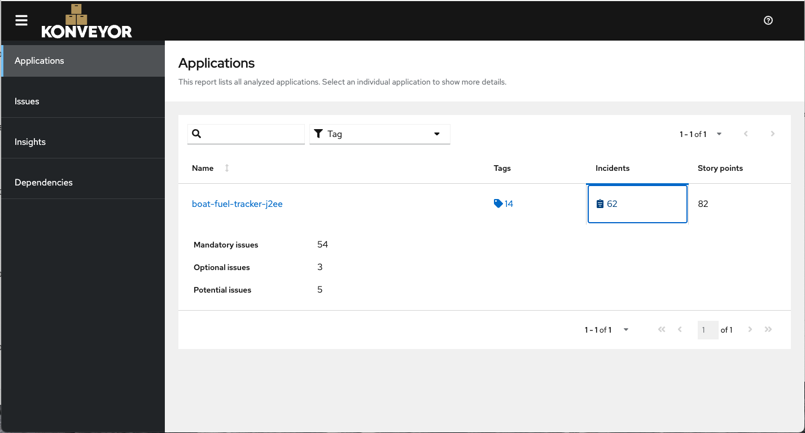

# Boat Fuel Tracker - Legacy J2EE Application

## Purpose

This is an **intentionally legacy** J2EE application designed for testing with [Konveyor](https://www.konveyor.io/) application modernization tools. It contains numerous anti-patterns, deprecated APIs, and vendor-specific code that Konveyor rules should detect and flag for modernization.

## Anti-Patterns and Violations Included

This application intentionally includes the following violations that Konveyor should detect:

### 1. EJB Anti-Patterns (Manual JNDI Lookups)
**Files:**
- `src/main/java/com/boatfuel/ejb/FuelUpService.java` - @Local interface
- `src/main/java/com/boatfuel/ejb/FuelUpServiceBean.java` - @Stateless bean
- `src/main/java/com/boatfuel/ejb/FuelUpServiceHome.java` - EJB 2.x Home interface (legacy)
- `src/main/java/com/boatfuel/ejb/FuelUpServiceRemote.java` - EJB 2.x Remote interface (legacy)
- `src/main/java/com/boatfuel/servlet/FuelUpServlet.java` - Manual JNDI lookup
- `src/main/webapp/WEB-INF/ejb-jar.xml` - EJB 2.x deployment descriptor

**Violations:**
- Manual JNDI lookup: `InitialContext().lookup("java:global/boat-fuel-tracker/FuelUpService")`
- No dependency injection (@EJB not used)
- EJB 2.x Home/Remote interfaces still present (unused but in codebase)
- Old-style EJB deployment descriptors (ejb-jar.xml)
- Manual EJB lookup in servlet init() method instead of @EJB injection

**Modernization:**
- Use `@EJB` dependency injection instead of JNDI lookups
- Replace with CDI beans (`@ApplicationScoped`, `@Inject`)
- Remove Home/Remote interfaces and ejb-jar.xml
- Remove manual InitialContext usage

### 2. Hibernate Proprietary Annotations
**Files:**
- `src/main/java/com/boatfuel/entity/User.java`
- `src/main/java/com/boatfuel/entity/FuelUp.java`

**Violations:**
- `@org.hibernate.annotations.Cache` - Hibernate-specific caching
- `@org.hibernate.annotations.GenericGenerator` - Hibernate ID generation
- `@org.hibernate.annotations.Type` - Hibernate-specific types
- `@org.hibernate.annotations.CreationTimestamp` - Hibernate timestamps
- `@org.hibernate.annotations.Index` - Old Hibernate index annotation

**Modernization:**
- Use standard JPA 2.2/3.0 annotations
- Replace `@GenericGenerator` with `@GeneratedValue(strategy = GenerationType.UUID)`
- Use JPA 2.2 `@Index` in `@Table` annotation
- Use JPA lifecycle callbacks instead of Hibernate timestamps

### 3. Hardcoded JNDI Lookups
**Files:**
- `src/main/java/com/boatfuel/util/JNDILookupHelper.java`
- `src/main/java/com/boatfuel/servlet/FuelUpServlet.java`
- `src/main/java/com/boatfuel/ejb/FuelUpServiceBean.java`

**Violations:**
- Manual `InitialContext` creation
- Hardcoded JNDI names: `"jdbc/BoatFuelTrackerDS"`, `"ejb/com/boatfuel/*"`
- No dependency injection
- Manual resource lookups instead of `@Resource` or `@Inject`

**Modernization:**
- Use `@Resource` for datasource injection
- Use `@EJB` or `@Inject` for bean injection
- Remove manual JNDI lookups
- Use CDI for dependency management

### 4. Vendor-Specific APIs
**Files:**
- `src/main/java/com/boatfuel/util/JNDILookupHelper.java`
- `src/main/java/com/boatfuel/util/FileSystemHelper.java`
- `pom.xml`

**WebSphere-specific:**
- `com.ibm.websphere.naming.WsnInitialContextFactory`
- `corbaloc:iiop:` IIOP protocol references
- WebSphere JTA platform in persistence.xml

**JBoss-specific:**
- `org.jboss.vfs.VFS` API usage
- JBoss-specific JNDI paths: `"java:jboss/*"`

**Modernization:**
- Remove vendor-specific API dependencies
- Use standard Java EE/Jakarta EE APIs
- Externalize server-specific configuration
- Use portable patterns compatible with any application server

### 5. File System Dependencies
**Files:**
- `src/main/java/com/boatfuel/util/FileSystemHelper.java`
- `src/main/resources/log4j.properties`

**Violations:**
- Hardcoded absolute paths:
  - `/opt/boatfuel/config`
  - `/var/log/boatfuel`
  - `C:\BoatFuel\exports` (Windows path)
- Direct file system I/O operations
- Configuration files on file system
- File-based audit logging

**Modernization:**
- Use ConfigMaps or environment variables for configuration
- Use volume mounts for file storage
- Use centralized logging (stdout/stderr)
- Use object storage (S3, etc.) instead of local file system
- Remove hardcoded paths

### 6. Old Servlet API (2.5)
**Files:**
- `src/main/webapp/WEB-INF/web.xml` - Servlet 2.5 descriptor
- `src/main/java/com/boatfuel/servlet/FuelUpServlet.java` - Data servlet with HTML generation
- `src/main/java/com/boatfuel/servlet/IndexServlet.java` - Template-based index servlet
- `src/main/java/com/boatfuel/servlet/LogoutServlet.java` - Logout handler
- `src/main/webapp/index-template.html` - HTML template

**Violations:**
- XML-based servlet configuration instead of annotations
- `<servlet>` and `<servlet-mapping>` in web.xml
- `extends HttpServlet` without `@WebServlet`
- `<ejb-ref>` references in web.xml
- HTML generation in servlet using `PrintWriter` (FuelUpServlet)
- Manual string replacement for templating (IndexServlet)
- No proper template engine
- Manual parameter extraction without validation framework
- No REST API - returns HTML instead of JSON

**Modernization:**
- Use `@WebServlet` annotations
- Remove web.xml servlet mappings
- Use modern MVC framework (JAX-RS for REST, Spring MVC)
- Use proper templating engine (Thymeleaf, Freemarker)
- Implement REST API with JSON responses
- Use Bean Validation for input validation

### 7. Deprecated Logging Framework
**Files:**
- `src/main/resources/log4j.properties`
- All Java files using `org.apache.log4j.Logger`

**Violations:**
- Log4j 1.x usage (has known security vulnerabilities)
- Hardcoded log file paths in configuration
- Direct Log4j API usage throughout code

**Modernization:**
- Migrate to Log4j 2.x or SLF4J + Logback
- Use container logging (stdout/stderr)
- Remove file-based logging
- Use structured logging (JSON format)

### 8. Mixed JPA and JDBC
**Files:**
- `src/main/java/com/boatfuel/ejb/FuelUpServiceBean.java`

**Violations:**
- Direct JDBC `Connection`/`PreparedStatement` usage
- Manual SQL queries alongside JPA
- Manual resource management (no try-with-resources)
- Mixing persistence paradigms in same class

**Modernization:**
- Use JPA for all database operations
- Use JPQL or Criteria API instead of SQL
- Remove direct JDBC code
- Use JPA repositories pattern

### 9. Manual Session Management
**Files:**
- `src/main/java/com/boatfuel/servlet/FuelUpServlet.java` - Manual session getAttribute/setAttribute
- `src/main/java/com/boatfuel/servlet/LogoutServlet.java` - Manual session invalidation
- `src/main/webapp/WEB-INF/web.xml` - HTTP Basic Auth configuration

**Violations:**
- Manual `HttpSession` management in servlets
- `session.getAttribute("userId")` / `session.setAttribute("userId", ...)`
- Manual session invalidation in logout
- HTTP Basic Auth (cannot properly logout - credentials cached by browser)
- Default userId set in servlet when not in session
- No stateless authentication (JWT, OAuth2)

**Modernization:**
- Use stateless authentication (JWT tokens)
- Use modern security framework (Spring Security, Jakarta Security)
- Use OAuth2/OpenID Connect
- Remove manual session management
- Make application stateless for cloud deployment

### 10. Hibernate-Specific Configuration
**Files:**
- `src/main/resources/META-INF/persistence.xml`
- `src/main/webapp/WEB-INF/resources.xml` - TomEE datasource config

**Violations:**
- `org.hibernate.ejb.HibernatePersistence` provider
- Hibernate-specific properties: `hibernate.dialect`, `hibernate.hbm2ddl.auto`
- `hibernate.cache.use_second_level_cache` configuration
- Vendor-specific JTA platform: `org.hibernate.service.jta.platform.internal.SunOneJtaPlatform`
- MySQL-specific dialect hardcoded
- Database credentials in resources.xml (Password = boatfuel123)
- JtaManaged datasource in application WAR

**Modernization:**
- Use standard JPA provider configuration
- Externalize database-specific settings to environment variables
- Use standard JPA properties
- Remove vendor-specific transaction platform
- Use Kubernetes secrets for database credentials
- Configure datasource at server level, not in WAR

### 11. Environment-Specific Configuration in Code
**Files:**
- `src/main/webapp/WEB-INF/web.xml`

**Violations:**
- `<env-entry>` with hardcoded paths
- Configuration in deployment descriptor
- No externalized configuration

**Modernization:**
- Use external configuration (ConfigMaps, environment variables)
- Use Spring Boot application.properties/yaml
- Use MicroProfile Config
- 12-factor app compliance

### 12. Security Anti-Patterns
**Files:**
- `src/main/webapp/WEB-INF/web.xml` - Security constraints and auth config
- `src/main/webapp/WEB-INF/resources.xml` - Database password
- `$TOMEE_HOME/conf/tomcat-users.xml` - User credentials (external)

**Violations:**
- HTTP Basic Authentication (legacy, no proper logout support)
- `<security-constraint>` and `<auth-constraint>` in web.xml instead of annotations
- `<login-config>` with BASIC auth method
- Database password in resources.xml: `Password = boatfuel123`
- User credentials in tomcat-users.xml (cleartext passwords)
- `request.getRemoteUser()` for authentication state
- No password encryption or hashing
- No HTTPS enforcement
- No CSRF protection

**Modernization:**
- Use Jakarta EE Security API or Spring Security
- Use OAuth2/OpenID Connect (Keycloak, Auth0)
- Externalize credentials to Kubernetes secrets
- Use vault or secret management system
- Implement form-based or token-based authentication
- Enforce HTTPS
- Add CSRF protection

## Running Konveyor Analysis

### Prerequisites
```bash
# Install Konveyor CLI
# Follow instructions at https://github.com/konveyor/analyzer-lsp

# https://github.com/konveyor/kantra/releases/

# Best to run in containerless-mode
# https://github.com/konveyor/kantra/blob/main/docs/containerless.md
```

### Build the Application
```bash
mvn clean package
```

### Run Konveyor Analysis
```bash
% kantra analyze --input ~/Workspace/boat-fuel-tracker-j2ee \
  --output ./konveyor-report \
  --source java-ee \
  --target quarkus \
  --target cloud-readiness \
  --target jakarta-ee9
```

### Expected Violations

Konveyor should detect and report:

1. **Manual JNDI lookup violations** - InitialContext().lookup() in servlets
2. **EJB 2.x legacy interfaces** - Home/Remote interfaces in codebase
3. **20+ Hibernate proprietary API usages** - @Cache, @Type, @GenericGenerator
4. **10+ hardcoded configuration issues** - Paths in web.xml, credentials in XML
5. **10+ file system dependency issues** - Hardcoded paths, file I/O operations
6. **5+ vendor-specific API usages** - IIOP, WebSphere JTA platform
7. **Log4j 1.x security vulnerabilities** - CVE-2019-17571, CVE-2020-9488
8. **Servlet 2.5 migration needs** - web.xml configuration, no annotations
9. **HTML generation in servlets** - PrintWriter with HTML strings
10. **Manual session management** - HttpSession getAttribute/setAttribute
11. **HTTP Basic Auth limitations** - No proper logout, cleartext passwords
12. **Missing input validation** - Manual parameter extraction without framework
13. **Database credentials in WAR** - resources.xml with passwords
14. **Mixed JDBC and JPA** - Direct SQL alongside EntityManager



## Modernization Path

### Target Architecture Options

#### Option 1: Jakarta EE 10
- Migrate to EJB 3.x or CDI
- Use standard JPA 3.0
- Update to Servlet 5.0+
- Use Jakarta EE Security API

#### Option 2: Quarkus
- Replace EJBs with CDI beans
- Use Quarkus extensions
- Use RESTEasy Reactive for REST
- Hibernate ORM with Panache

#### Option 3: Spring Boot
- Replace EJBs with Spring beans
- Use Spring Data JPA
- Use Spring MVC or WebFlux
- Spring Security

### Cloud-Native Targets
- Containerize with Docker
- Deploy to Kubernetes/OpenShift
- Use external configuration (ConfigMaps)
- Use external storage (PVC, S3)
- Implement health checks and metrics
- Use distributed tracing

## Original Application

This is a modernized version of the Boat Fuel Tracker PWA that was converted back to legacy J2EE to demonstrate Konveyor's capabilities.

## License

MIT License - This code is intentionally bad for demonstration purposes!
